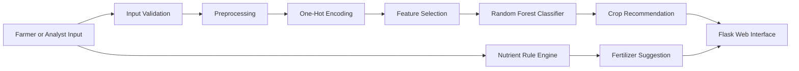

# Smart Farming Decision Support System

## 1. Introduction and Problem Statement

Agriculture decisions are often made with limited visibility into soil nutrients, climate conditions, and location-specific suitability. This can lead to crop mismatch, weak yield performance, unnecessary fertilizer usage, and avoidable financial loss.

This project addresses that problem with a machine learning based decision support system that recommends a suitable crop and a fertilizer plan from field inputs. The system is designed to assist farmers and agriculture planners by turning soil, weather, and location data into practical guidance.

## 2. Objectives

- Predict the most suitable crop from soil and environmental conditions.
- Suggest a fertilizer plan that is consistent with nutrient balance and crop requirements.
- Provide a simple Flask web interface for manual input and instant recommendations.
- Build a reproducible data pipeline with preprocessing, feature selection, training, and evaluation.
- Deliver an explanation-friendly output that supports presentation and discussion.

## 3. System Architecture

The system follows a two-layer decision flow:

- A machine learning model predicts the crop class.
- A rule-based recommendation layer maps nutrient status to fertilizer guidance.

## 4. Methodology

### 4.1 Data preparation

The dataset contains **1,920 records** across **16 crop classes**. It includes soil, climate, and location variables selected to reflect practical farm conditions.

### 4.2 Preprocessing

The pipeline applies the following steps:

- Median imputation for numeric values.
- Most-frequent imputation for categorical values.
- One-hot encoding for categorical fields.
- Feature selection using mutual information.

### 4.3 Train-test split

The data was split using an **80/20 stratified split** so that all crop classes remain represented in both the training and testing sets.

### 4.4 Model training

The main classifier is a **Random Forest** model with the following configuration:

- `n_estimators = 260`
- `max_depth = 14`
- `min_samples_split = 4`
- `min_samples_leaf = 2`
- `class_weight = balanced_subsample`

### 4.5 Fertilizer recommendation logic

Fertilizer guidance is based on the predicted crop profile and the observed nutrient levels. If one or more nutrients fall below the preferred range, the recommendation adds the relevant nutrient correction while preserving the base crop plan.

## 5. Dataset Description

| Field group | Key attributes |
| --- | --- |
| Soil nutrients | Nitrogen, phosphorus, potassium, soil pH, soil moisture, organic matter |
| Weather profile | Temperature, humidity, rainfall, sunlight hours, altitude |
| Location and management | Soil type, agro-climatic region, state, season, irrigation method |
| Target | Crop label |

The dataset is structured to support mixed feature types and to preserve realistic crop-specific conditions. The final dataset file is stored at `data/crop_recommendation_dataset.csv`.

## 6. Model Details and Algorithms Used

### Random Forest classifier

Random Forest was selected because it is well suited to this problem for the following reasons:

- It captures nonlinear relationships between soil, weather, and crop choice.
- It handles mixed numeric and categorical inputs after encoding.
- It is robust to noise and small variations in input conditions.
- It provides feature importance values that are useful for interpretation.

### Feature selection

Mutual information based selection was used after encoding. This keeps the most informative transformed features and reduces unnecessary dimensionality.

### Rule-based fertilizer engine

A deterministic fertilizer layer was used for the recommendation output. This makes the fertilizer suggestion consistent and easy to explain during presentation.

## 7. Results and Performance Analysis

### Evaluation summary

| Metric | Value |
| --- | --- |
| Training records | 1,536 |
| Testing records | 384 |
| Crop classes | 16 |
| Accuracy | 96.09% |
| Weighted precision | 96.42% |
| Weighted recall | 96.09% |
| Weighted F1-score | 96.12% |
| 5-fold cross-validation mean | 95.25% |
| 5-fold cross-validation std. | 0.98% |

### Top influential features

The strongest contributors to the model were:

- Nitrogen
- Rainfall
- Sunlight hours
- Potassium
- Soil moisture
- Humidity
- Temperature
- Altitude
- Phosphorus
- Season

These features align with agronomic expectations because crop suitability depends heavily on nutrient balance and climate compatibility.

### Classification behavior

The confusion matrix shows strong overall separation between crop classes. Most classes achieved near-perfect precision and recall. The remaining errors were concentrated in crops with overlapping agronomic conditions, especially where nutrient and climate ranges are similar.

The per-class evaluation report is stored in `reports/classification_report.txt`, and the plots are available in:

- `reports/feature_importance.png`
- `reports/confusion_matrix.png`

### Interpretation

The performance level is strong enough for a decision support prototype and remains consistent with the project goal of practical recommendation support rather than exact farm-level automation.

## 8. Output Explanation

The web application returns the following outputs:

- Recommended crop name
- Confidence score for the top crop
- Suggested fertilizer plan
- Top alternative crops with ranked confidence
- Matching conditions that support the prediction
- Attention points when any input is outside the preferred range

This output format helps users understand both the recommendation and the reasoning behind it.

## 9. Conclusion and Future Scope

### Conclusion

The implemented Smart Farming Decision Support System successfully combines machine learning and rule-based recommendation logic to support crop selection and fertilizer planning. The model demonstrates strong predictive performance and produces output that is clear, practical, and presentation-ready.

### Future scope

- Add live weather and soil sensor integration.
- Expand the crop set with more regional varieties.
- Include yield estimation and irrigation planning.
- Deploy the system with persistent storage and user management.
- Add explainability views such as SHAP-based feature contribution charts.
